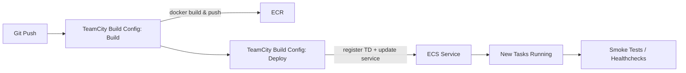

# TeamCity → AWS ECS Deploy

CI/CD pipelines that build a Docker image, register a new ECS task definition, and update an ECS service — all from TeamCity.

---

## TL;DR

```text
1. Build & push image to ECR
2. Render task definition JSON (from `test-td.json`)
3. aws ecs register-task-definition …
4. aws ecs update-service --force-new-deployment …
5. Smoke test → rollback if needed
```

---

## Repo Structure

```
.
├── steps/                              # helper scripts (bash/ps1/etc.)
├── test-td.json                        # example ECS task definition template
├── AWS_ECS_update_task_definition.txt  # cli snippets to update TD
├── AWS_ECS_update_task_definition_USEFULL_LINKS.txt
└── README.md
```

Adjust/rename as you see fit.

---

## Prerequisites

### AWS
- ECS cluster + service (Fargate or EC2 launch type).
- ECR repo for your image.
- IAM user/role with permissions for:  
  `ecs:{Describe*,List*,RunTask,StopTask,RegisterTaskDefinition,UpdateService}`,  
  `ecr:*` needed for push/pull, and optional `cloudwatch:GetMetricStatistics` if you throttle by cluster CPU.

### TeamCity
- Version 2017.1+ (if you plan to use the JetBrains ECS plugin) or any version with AWS CLI available on agents.
- Build agents with Docker, AWS CLI v2, `jq` (or similar templating tool).

---

## Variables You’ll Need (TeamCity parameters)

Define these as **Project Parameters** (System/Env):

| Name | Example |
|------|---------|
| `env.AWS_REGION` | `eu-central-1` |
| `env.AWS_ACCOUNT_ID` | `123456789012` |
| `env.ECR_REPO` | `my-app` |
| `env.IMAGE_TAG` | `%build.number%` |
| `env.CLUSTER_NAME` | `my-ecs-cluster` |
| `env.SERVICE_NAME` | `my-ecs-service` |
| `env.TASK_FAMILY` | `my-task-family` |
| `env.TASK_ROLE_ARN` | `arn:aws:iam::123456789012:role/ecsTaskRole` |
| `env.EXEC_ROLE_ARN` | `arn:aws:iam::123456789012:role/ecsExecRole` |

(Use whatever naming convention you prefer; just stay consistent.)

---

## Pipeline Design



You can keep this as a single build configuration with multiple steps or split into a Build → Deploy chain.

---

## Step-by-Step Setup

### 1. Build & Push Docker Image
- **Runner:** Command Line (or Docker build runner)
- **Script example:**
  ```bash
  set -euo pipefail

  IMAGE="${AWS_ACCOUNT_ID}.dkr.ecr.${AWS_REGION}.amazonaws.com/${ECR_REPO}:${IMAGE_TAG}"

  aws ecr get-login-password --region "${AWS_REGION}" \
    | docker login --username AWS --password-stdin "${AWS_ACCOUNT_ID}.dkr.ecr.${AWS_REGION}.amazonaws.com"

  docker build -t "${IMAGE}" .
  docker push "${IMAGE}"
  ```

### 2. Render Task Definition JSON
Take `test-td.json` as a template. Replace image tag and other fields:

```bash
jq \
  --arg IMG "${AWS_ACCOUNT_ID}.dkr.ecr.${AWS_REGION}.amazonaws.com/${ECR_REPO}:${IMAGE_TAG}" \
  '.containerDefinitions[0].image = $IMG' \
  test-td.json > td.rendered.json
```

(If you don’t want `jq`, use `envsubst`, `sed`, Helm, yq, etc.)

### 3. Register New Task Definition
```bash
TASK_DEF_ARN=$(aws ecs register-task-definition \
  --cli-input-json file://td.rendered.json \
  --query 'taskDefinition.taskDefinitionArn' \
  --output text)
echo "##teamcity[setParameter name='env.TASK_DEF_ARN' value='${TASK_DEF_ARN}']"
```

### 4. Update the ECS Service
```bash
aws ecs update-service \
  --cluster "${CLUSTER_NAME}" \
  --service "${SERVICE_NAME}" \
  --task-definition "${TASK_DEF_ARN}" \
  --force-new-deployment
```

### 5. Wait & Verify
Optionally wait until deployment stabilizes:

```bash
aws ecs wait services-stable \
  --cluster "${CLUSTER_NAME}" \
  --services "${SERVICE_NAME}"
```

Run smoke tests (curl health endpoint, run integration tests, etc.). Fail build if checks fail.

### 6. Rollback
Keep the previous `TASK_DEF_ARN` (store it in a TeamCity parameter or S3). To roll back:

```bash
aws ecs update-service \
  --cluster "${CLUSTER_NAME}" \
  --service "${SERVICE_NAME}" \
  --task-definition "${PREV_TASK_DEF_ARN}" \
  --force-new-deployment
```

---

## Optional: Use the TeamCity Amazon ECS Plugin

Instead of CLI calls, you can install the JetBrains **Amazon ECS Support** plugin, create a Cloud Profile and let TeamCity spin agents/tasks automatically. Still, the deploy-to-your-app-service flow above remains the same — you just offload agent lifecycle to the plugin.

---

## Troubleshooting

- **`aws: command not found`** – ensure AWS CLI is installed on the agent and on PATH.
- **Service doesn’t use new image** – you forgot to register a new TD or to `--force-new-deployment`.
- **Stuck deployments** – check ECS events tab; usually permission, CPU/Memory reservation, or bad health checks.
- **Template errors** – validate JSON: `jq empty td.rendered.json`.

---

## Useful Commands

```bash
# List last 5 task definition ARNs for a family
aws ecs list-task-definitions --family-prefix "${TASK_FAMILY}" --sort DESC --max-items 5

# Describe the current service task definition
aws ecs describe-services --cluster "${CLUSTER_NAME}" --services "${SERVICE_NAME}" \
  --query 'services[0].taskDefinition'

# Deregister old, unused TDs (optional cleanup)
aws ecs deregister-task-definition --task-definition <arn>
```

---

## Useful AWS ECS Links

- AWS CLI: `ecs register-task-definition`  
  https://docs.aws.amazon.com/cli/latest/reference/ecs/register-task-definition.html

- AWS CLI: `ecs update-service`  
  https://docs.aws.amazon.com/cli/latest/reference/ecs/update-service.html

- AWS CLI: waiters (`services-stable`, etc.)  
  https://docs.aws.amazon.com/cli/latest/reference/ecs/wait/index.html

- Amazon ECS task definitions (concepts & JSON fields)  
  https://docs.aws.amazon.com/AmazonECS/latest/developerguide/task_definitions.html

- Listing and describing task definitions/services  
  https://docs.aws.amazon.com/cli/latest/reference/ecs/list-task-definitions.html  
  https://docs.aws.amazon.com/cli/latest/reference/ecs/describe-services.html

- JetBrains guide
  https://www.jetbrains.com/help/teamcity/install-teamcity-agent.html#Install+from+ZIP+File
  https://www.jetbrains.com/help/teamcity/configure-agent-installation.html

- Register new task definition
  https://doylew.medium.com/updating-aws-ecs-task-definition-and-scheduled-tasks-using-aws-cli-commands-through-deployment-jobs-7cef82262236

- Update service with new task definition
  https://devops4solutions.com/how-to-update-aws-ecs-service/